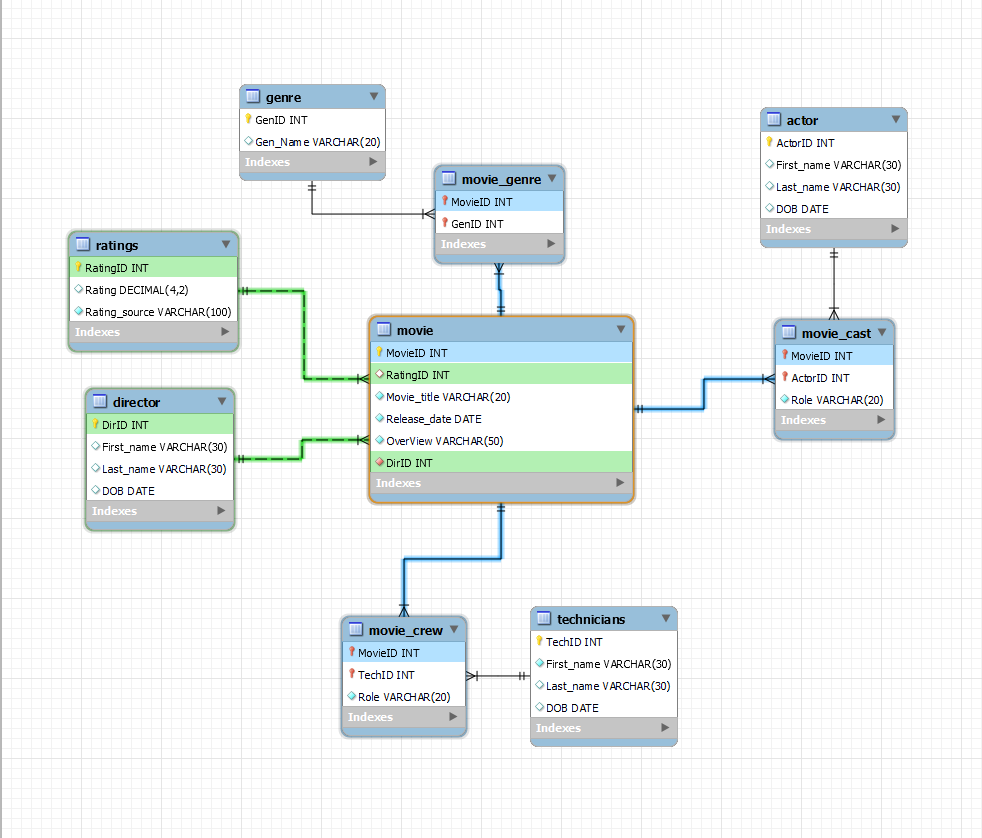

# Internship Assignment submission

## Problem Statement 
Build a simple relational database schema to manage a movie database, and create basic GET, PUT methods 

## Schema 
<p align="center">
  
</p>

## Get DataBase
[Click here](./assets/Dump) to access the MYSQL dump folder and import it to your MYSQL workbench
This folder has the data and well as the structure
1) Download the file
2) Open MYSQL workbench and create a new schema movie_10x
3) Import the folder into the workbench (Data Import option under Server)
4) Execute query to disable sql safe update 
   ``` script
   SET SQL_SAFE_UPDATES = 0;
   ```
## Create table queries
For table queries [Click here](./assets/CreateTable.sql)

## JavaScript Implementation
[Click Here](./JavaScript)
